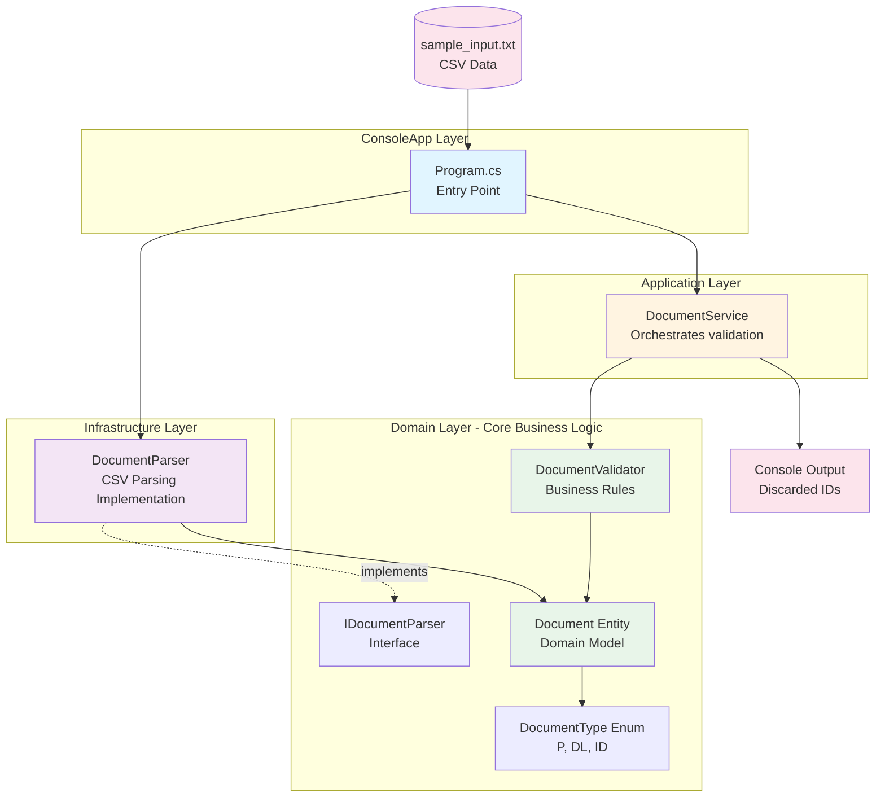
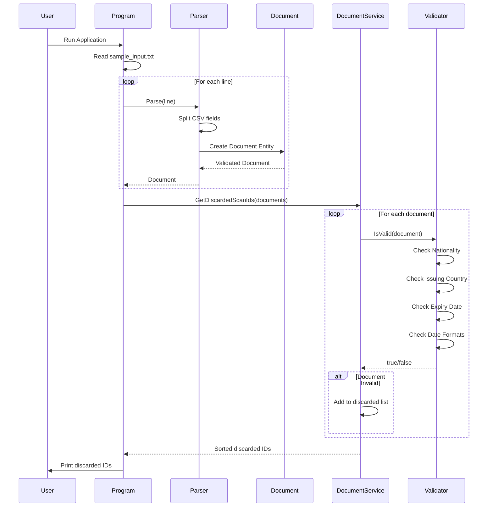
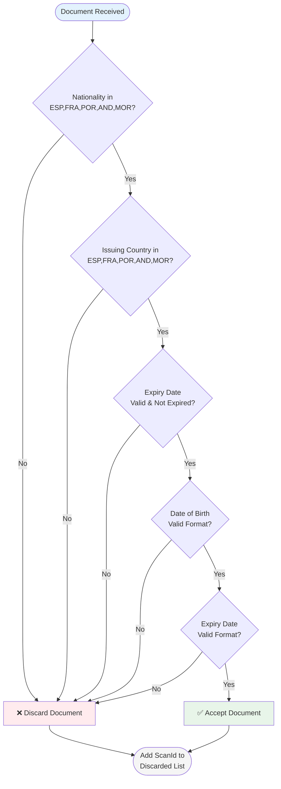

# DocScanFilter

## 🧾 Overview
DocScanFilter is a C# application designed to parse and validate identity documents from scanned data. It applies business rules to discard invalid or duplicate records. The application follows **Clean Architecture** and **DDD** principles, making the solution modular and testable.

## 📊 Solution Architecture Diagram



### Data Flow



### Business Rules Validation Flow



## 🏗️ Architecture Structure
```
DocScanFilter/
├── Domain/                   # Core business rules
│   ├── Entities/             # Document.cs
│   ├── Enums/                # DocumentType.cs
│   └── Services/             # DocumentValidator.cs
│
├── Application/             # Orchestration and use case logic
│   └── DocumentService.cs
│
├── Infrastructure/          # Adapters and external implementations
│   └── Parsers/             # DocumentParser.cs (implements IDocumentParser)
│
├── ConsoleApp/              # Entry point for the console app
│   └── Program.cs
│
├── Tests/                   # Unit tests (optional)
│   └── (future test files)
│
├── sample_input.txt         # Input file for testing
├── DocScanFilter.sln        # Solution file
└── README.md                # This file
```

## 🚀 How it works
The app reads input from a file called `sample_input.txt` at the root of the solution.
- The first line must contain an integer N: the number of document records to process.
- The next N lines must contain comma-separated document data in the format:

```
scanId,documentType,issuingCountry,lastName,firstName,documentNumber,nationality,dateOfBirth,dateOfExpiry
```

Example:
```
3
1,P,ESP,PEREZ,JAVIER,10011,ESP,021103,190510
2,DL,FRA,PEREZ,JAVIER,5454,ESP,021103,270510
3,DL,FRA,PEREZ,JAVIER,5454,ESP,021013,280510
```

## 🎯 Business Rules
A document is discarded if:
- It has an invalid date format.
- It is already expired.
- The issuing country or nationality is not among: `ESP`, `FRA`, `POR`, `AND`, `MOR`.
- It's a duplicate of an already scanned document.

## 🧪 Running the App
Make sure you are in the root of the solution and have .NET 8 installed.

```bash
# Build the solution
dotnet build DocScanFilter.sln

# Run the app
dotnet run --project ConsoleApp
```

It will read `sample_input.txt`, process the documents and print discarded IDs in ascending order.

## ✅ Example Output
```
2,3
```

This indicates that documents with ScanIds 2 and 3 were discarded.

---
Feel free to extend this project with logging, database storage, or a web interface!